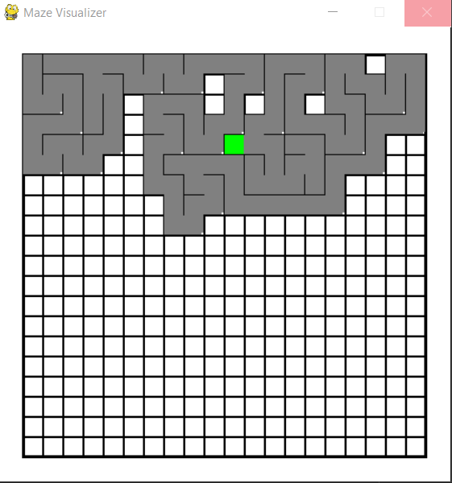

# Rubix Cube
## Requirements
Lib used: pygame
```
   pip install pygame
```
## Logic
This Maze generation is based on DFS.
- Create a empty stack, a empty list visited.
- Choose a random direction to explore (Up Down Left Right) that is not in visited list.
- Move to the next position, push on to the stack and visited list.
- When every direction is visited, back track to previous position using stack.pop().
- When every possible vertex is explored, it will go back to its starting position.

## Kown Bugs
Program crashes on click when running (Anywhere on screen)
- Cause: While loop conflicting with pygame update while loop
- Fix: Multi threading (Too lazy)

## Interface & View
Colour used to provide clear indication.
🟩  Current Point
⬛ Path already explored

